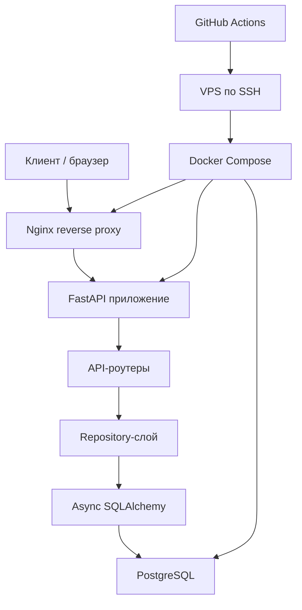

# Movie Tracker FastAPI


## Ссылка на сайт

[Перейти на сайт](https://personal-movietracker.ru/)


## Docker
=======
Movie Tracker FastAPI — компактный backend-проект для управления списком фильмов с хранением данных в PostgreSQL. Приложение предоставляет FastAPI API, использует асинхронный SQLAlchemy для работы с базой, содержит маршруты для JWT-аутентификации и запускается через Docker Compose.

Проект небольшой, но показывает ключевые backend-навыки: проектирование API, валидацию данных, работу с PostgreSQL, разделение роутов и слоя доступа к данным, контейнеризацию, health check, reverse proxy и автоматизированный деплой по SSH.

## Обзор Архитектуры



Для локальной разработки API и PostgreSQL можно поднять через Docker Compose. В репозитории также есть конфигурация Nginx для reverse proxy с HTTPS и GitHub Actions workflow для деплоя на сервер по SSH.

## Технологический Стек

| Область | Технологии |
| --- | --- |
| API | FastAPI, Uvicorn |
| Язык | Python |
| База данных | PostgreSQL |
| ORM / доступ к БД | SQLAlchemy async engine, asyncpg |
| Валидация | Pydantic |
| Аутентификация | JWT, passlib bcrypt |
| Контейнеризация | Docker, Docker Compose |
| Reverse proxy | Nginx |
| Автоматизация деплоя | GitHub Actions workflow по SSH |
| Тестирование | pytest, FastAPI TestClient |

## Возможности

- CRUD-маршруты для фильмов: список, получение по id, создание, обновление, удаление.
- Маршруты для регистрации и логина пользователя.
- Генерация JWT access token.
- Хеширование и проверка паролей через passlib bcrypt.
- Хранение данных в PostgreSQL через асинхронные SQLAlchemy-сессии.
- Repository-слой для отделения HTTP-роутов от SQL-запросов.
- Health check маршрут с проверкой доступности базы данных.
- Dockerized окружение для FastAPI и PostgreSQL.
- Nginx reverse proxy с редиректом HTTP на HTTPS.
- GitHub Actions workflow для деплоя на сервер по SSH.
- Минимальный HTML-фронтенд, который отдаётся через FastAPI.

## Структура Проекта

```text
.
├── back/
│   ├── auth.py             # JWT, decode helper и хеширование паролей
│   ├── auth_router.py      # Маршруты аутентификации
│   ├── db.py               # Async SQLAlchemy engine, session factory, создание таблиц
│   ├── main.py             # FastAPI-приложение, подключение роутеров, frontend, health check
│   ├── models.py           # SQLAlchemy-модели
│   ├── repository.py       # Функции доступа к базе данных
│   ├── router.py           # API-маршруты фильмов
│   └── schemas.py          # Pydantic-схемы запросов и ответов
├── front/
│   └── index.html          # Минимальный браузерный UI для операций с фильмами
├── nginx/
│   └── default.conf        # Reverse proxy и HTTPS-конфигурация
├── tests/
│   ├── conftest.py         # Fixture для FastAPI TestClient
│   └── test_health.py      # Тесты health-маршрута
├── .github/workflows/
│   └── deploy.yml          # Workflow деплоя по SSH
├── Dockerfile              # Multi-stage образ Python-приложения
├── docker-compose.yml      # PostgreSQL, FastAPI-приложение и Nginx services
├── requirements.txt        # Python-зависимости
└── README.md
```

## API-Маршруты

### Фильмы

| Метод | Маршрут | Описание |
| --- | --- | --- |
| `GET` | `/movies` | Получить список всех фильмов. |
| `GET` | `/movies/{movie_id}` | Получить фильм по id. |
| `POST` | `/movies` | Создать фильм. |
| `PATCH` | `/movies/{movie_id}` | Частично обновить фильм. |
| `DELETE` | `/movies/{movie_id}` | Удалить фильм. |

### Аутентификация

| Метод | Маршрут | Описание |
| --- | --- | --- |
| `POST` | `/auth/register` | Зарегистрировать пользователя и вернуть access token. |
| `POST` | `/auth/login` | Проверить credentials и вернуть access token. |

### Прочее

| Метод | Маршрут | Описание |
| --- | --- | --- |
| `GET` | `/` | Отдать минимальный HTML-фронтенд. |
| `GET` | `/health` | Проверить доступность приложения и базы данных. |

Интерактивная документация API доступна по адресу:

```text
http://127.0.0.1:8000/docs
```

## База Данных

Приложение использует PostgreSQL и асинхронный SQLAlchemy.

Реализованные модели:

| Модель | Таблица | Поля |
| --- | --- | --- |
| `Movie` | `movies` | `id`, `title`, `year` |
| `User` | `users` | `id`, `username`, `hashed_password` |

Связей между текущими моделями нет.

### Миграции

Alembic в репозитории не настроен. Таблицы создаются при старте приложения через:

```python
Base.metadata.create_all
```

Добавление Alembic-миграций — логичный следующий шаг перед тем, как рассматривать проект как production-ready сервис.

## Аутентификация

В репозитории есть код, связанный с аутентификацией:

- `POST /auth/register` принимает username и password.
- `POST /auth/login` проверяет credentials и возвращает bearer token.
- Хеширование и проверка паролей реализованы через passlib bcrypt.
- JWT access tokens создаются с claims `sub` и `exp`.
- `JWT_SECRET` читается из переменных окружения, с fallback-значением для разработки.

Маршруты фильмов сейчас не защищены JWT-авторизацией. В проекте есть генерация и decode helper для токенов, но route-level authorization middleware/dependencies пока не реализованы.

## Локальная Разработка

### 1. Клонировать репозиторий

```bash
git clone https://github.com/paxanraul/movie-tracker-fastapi.git
cd movie-tracker-fastapi
```

### 2. Создать environment file

Скопировать пример:

```bash
cp .env.example .env
```

Заполнить значения для PostgreSQL и JWT. Для Docker Compose `DATABASE_URL` должен указывать на сервис `db`, например:

```env
POSTGRES_DB=movie_db
POSTGRES_USER=movie_user
POSTGRES_PASSWORD=change_me
DATABASE_URL=postgresql+asyncpg://movie_user:change_me@db:5432/movie_db
JWT_SECRET=change_me
```

### 3. Запустить через Docker Compose

Для локальной разработки можно поднять базу и приложение:

```bash
docker compose up --build db app
```

Открыть приложение:

```text
http://127.0.0.1:8000
```

Swagger UI:

```text
http://127.0.0.1:8000/docs
```

### 4. Применить миграции

Отдельная команда миграций сейчас не требуется, потому что Alembic не настроен. Таблицы создаются автоматически при старте FastAPI.

### 5. Остановить сервисы

```bash
docker compose down
```

Остановить сервисы и удалить PostgreSQL volume:

```bash
docker compose down -v
```

## Переменные Окружения

| Переменная | Описание |
| --- | --- |
| `POSTGRES_DB` | Название PostgreSQL-базы для Docker `db` service. |
| `POSTGRES_USER` | Пользователь PostgreSQL для Docker `db` service. |
| `POSTGRES_PASSWORD` | Пароль PostgreSQL для Docker `db` service. |
| `DATABASE_URL` | Async SQLAlchemy connection string для FastAPI. |
| `JWT_SECRET` | Secret key для подписи JWT access tokens. |

Реальные secrets нельзя коммитить. `.env.example` используется как шаблон необходимых переменных.

## Тестирование

В репозитории есть pytest-тесты для health-маршрута:

```bash
pytest
```

Текущие тесты требуют доступную PostgreSQL-базу, потому что FastAPI lifespan создаёт таблицы, а `/health` проверяет соединение с БД.

## Деплой

В репозитории есть конфигурация для деплоя:

- `nginx/default.conf` настраивает Nginx reverse proxy для `personal-movietracker.ru` и `www.personal-movietracker.ru`.
- HTTP-трафик редиректится на HTTPS.
- Let's Encrypt webroot challenge paths настроены через `/.well-known/acme-challenge/`.
- `.github/workflows/deploy.yml` запускается при push в `main` или вручную через workflow dispatch.
- Деплой выполняется по SSH через GitHub repository secrets:
  - `SSH_HOST`
  - `SSH_USER`
  - `SSH_PRIVATE_KEY`
- На сервере workflow делает `git pull origin main`, пересобирает Docker Compose services и очищает неиспользуемые Docker images.

В репозитории есть Nginx и GitHub Actions deployment configuration, но команды генерации сертификатов и bootstrap-скрипты сервера не включены.

## Скриншоты

Скриншоты пока не добавлены в репозиторий. Рекомендуемые скриншоты:

- Swagger UI на `/docs`
- Ответ health endpoint
- Минимальный movie tracker frontend

## Будущие Улучшения

- Добавить Alembic migrations для версионирования схемы БД.
- Защитить маршруты фильмов через JWT authorization dependencies.
- Добавить integration tests для movie CRUD и auth flows.
- Добавить request/response models для ответов movie API.
- Добавить pagination и filtering для списка фильмов.
- Добавить structured logging и observability.
- Добавить rate limiting для маршрутов аутентификации.
- Добавить отдельный CI workflow для тестов помимо deploy workflow.
